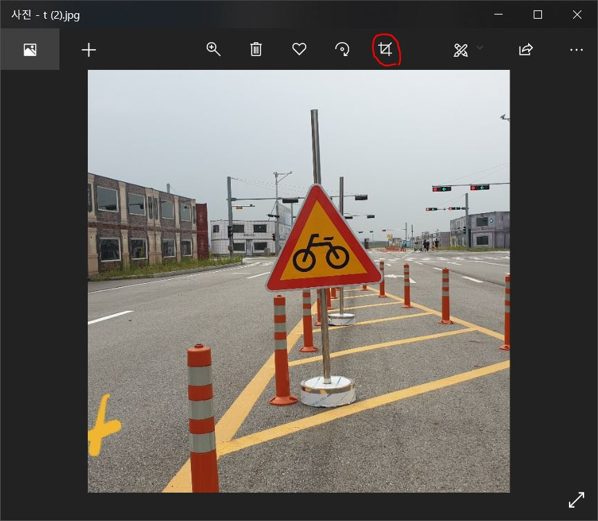
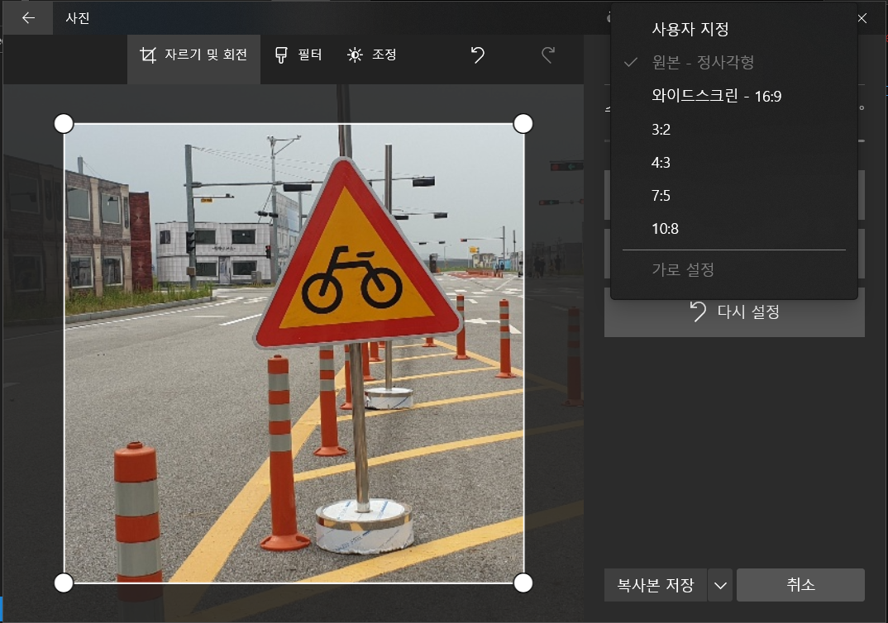

# Creating the Best Quality Image Dataset
* [original link](https://medium.com/@selectstar.ai/creating-the-best-quality-image-dataset-720f612944ed)

## Guideline
1. 기본적으로 이미지 데이터들이 **비슷하지 않을 수록** 좋습니다.
2. 각 클래스당 **150개** 부탁드리겠습니다. (약 100개 정도가 minimum 약 1000개 정도가 maximum으로 하겠습니다.)
3. **한 클래스는 한 사람이** 맡아서 하는게 가장 좋습니다.

4. 이미지는 **정사각형** 비율이 가장 좋습니다.
    * 윈도우에서 정사각형 비율 set하는 방법이 있는데 아래에 방법을 적어두겠습니다.
    * 맥과 리눅스 기반은.. 죄송합니다.ㅠ
5. 전체화면에서 신호등이 **차지하는 비율이 다양**하면 좋습니다.
    * 전체 이미지의 면적을 100이라고 했을 때, 신호등 이미지가 차지하는 비율이 약 95~5 정도 다양한게 좋습니다.
6. 이미지의 주변환경도 영향이 있기때문에 신호등의 **배경이 다양할 수록** 좋습니다.
7. 최종 resize를 `720*720`으로 할 것이기 떄문에 너무 작지 않게만 해주세요.
    * 조금 작으면 늘릴 수 있으나, 너무 작으면 확대하는 과정에서 화질이 떨어지기 때문에 좋지 않습니다. 
8. **다양한 각도**의 이미지가 좋습니다. 단, 심한 왜곡은 오히려 좋지 않으므로 기울이실때 약 10도 내외를 권장합니다.
    * 좌우 tilting
    * fliping 아닙니다.
9. 신호등을 **바라보는 시점**을 바꾸는 것도 좋습니다.(하지만 이건 아이패드에서만 되는 기능인것 같네요ㅠ)
    
> 작업하시면서 이미지 다양성을 위해 변형을 극한 조건으로 하다보면 `이 정도 크기도(변형도) 괜찮을까?` 싶을 때가 있습니다. 그러면 `사람이 판단할 수 있는 정도인가?`를 기준으로 삼으시면 됩니다.
    
## Cropping in Windows
1. 윈도우 사진 기본앱으로 사진을 열어주세요.
2. 상단의 자르기 아이콘을 눌러주세요

3. 오른쪽 옵션에 정사각형 비율 설정이 있습니다.
